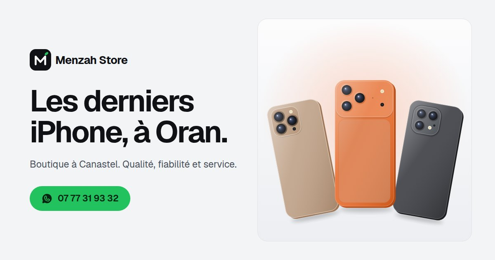

# Menzah Store : site et tableau de bord

Site de la boutique **Menzah Store** (téléphones, Canastel, Oran), avec un tableau de bord
pour gérer les commandes, les produits et les réglages.
Informations reprises des comptes [TikTok @menzah.store](https://www.tiktok.com/@menzah.store) et
[Instagram @menzah_store](https://www.instagram.com/menzah_store/).



## Adresses

| | |
|---|---|
| Site | https://menzah-store.vercel.app |
| Tableau de bord | https://menzah-store.vercel.app/admin/ |

## Le site

- **Catalogue** filtrable (iPhone, Android, accessoires) avec recherche.
  Les téléphones apparaissent avec une animation au défilement et s'inclinent au survol.
- **Commande en ligne** : le client choisit la couleur et la capacité, indique son nom et son
  téléphone, et la commande arrive **en direct** dans le tableau de bord (avec un son).
  Écran de confirmation animé avec le numéro de commande, et lien WhatsApp pour le suivi.
  Le client peut toujours choisir de commander directement sur WhatsApp.
- Vidéos TikTok et publications Instagram de la boutique affichées sur le site.
- Adresse, carte, bouton Itinéraire, numéros cliquables.
- Logo et couleur principale réglables depuis le tableau de bord : tout le site s'adapte,
  avec des contrastes toujours lisibles en mode clair et sombre.
- Si la base de données ne répond pas, le site fonctionne quand même avec `js/config.js`
  et `js/produits.js`, et les commandes passent par WhatsApp.

## Le tableau de bord (`/admin/`)

Connexion par e-mail et mot de passe. Trois onglets :

- **Commandes** : nouvelles commandes en direct, statut (nouvelle, confirmée, livrée, annulée),
  appel ou message WhatsApp au client en un clic, recherche et filtres.
- **Produits** : ajouter, modifier, supprimer, masquer, changer l'ordre ; photo (réduite
  automatiquement), couleurs, capacités, prix et prix barré, badge (Nouveau, Promo...),
  lien de la vidéo TikTok.
- **Réglages** : **logo** (importer une capture de la photo de profil Instagram ou TikTok : le site
  propose automatiquement les couleurs du logo), couleur du site, adresse, horaires, numéros,
  WhatsApp, livraison, réseaux, vidéos TikTok et publications Instagram affichées, mot de passe.

## Technique

- Site statique HTML, CSS et JavaScript, sans étape de construction.
- Base de données, connexion et photos : **Supabase** (projet `jxthopvlrwmbpmqbhkmy`, tables
  préfixées `menzah_`). Le schéma complet est dans `supabase/schema.sql`.
  - Sécurité : les visiteurs peuvent seulement lire le catalogue et passer commande via la
    fonction `menzah_passer_commande` (numéro algérien vérifié, 3 commandes maximum par numéro
    toutes les 10 minutes). Seuls les comptes de la table `menzah_admins` voient les commandes
    et modifient le site.
  - La clé présente dans `js/supabase-config.js` est une clé publique prévue pour le navigateur.
- Hébergement : **Vercel**, relié à ce dépôt GitHub : chaque modification poussée est mise en ligne.

```
index.html              page du site
css/style.css           apparence du site
js/app.js               fonctionnement du site (catalogue, commande, animations)
js/marque.js            logo et couleurs de la boutique
js/visuels.js           dessins des téléphones (en attendant les photos)
js/supabase-config.js   connexion à la base
js/config.js            réglages de secours (si la base ne répond pas)
js/produits.js          catalogue de secours
admin/                  tableau de bord
supabase/schema.sql     structure de la base de données
vercel.json             en-têtes de sécurité
```

## Ajouter un autre administrateur

1. Supabase > Authentication > Users > Add user (e-mail et mot de passe).
2. Dans SQL Editor :
   `insert into public.menzah_admins (user_id) select id from auth.users where email = 'adresse@exemple.com';`

## À vérifier

- **Catalogue** : seuls l'iPhone 16 Pro Max et l'OPPO Find X9 Pro (12/512 Go) ont été repérés
  dans les vidéos TikTok. Les autres produits sont une base à adapter depuis le tableau de bord.
- **WhatsApp** : le site utilise le 07 77 31 93 32 (modifiable dans Réglages).
- **Carte** : pour un repère exact, mettez les coordonnées GPS dans Réglages > Recherche pour la carte.

Police [Geist](https://github.com/vercel/geist-font) (SIL OFL 1.1), icônes [Phosphor](https://phosphoricons.com)
et [supabase-js](https://github.com/supabase/supabase-js) (MIT) : voir `LICENCES.md`.
Les marques citées (Apple, iPhone, OPPO, Samsung...) appartiennent à leurs propriétaires respectifs.
